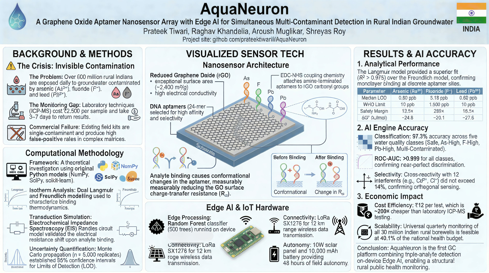
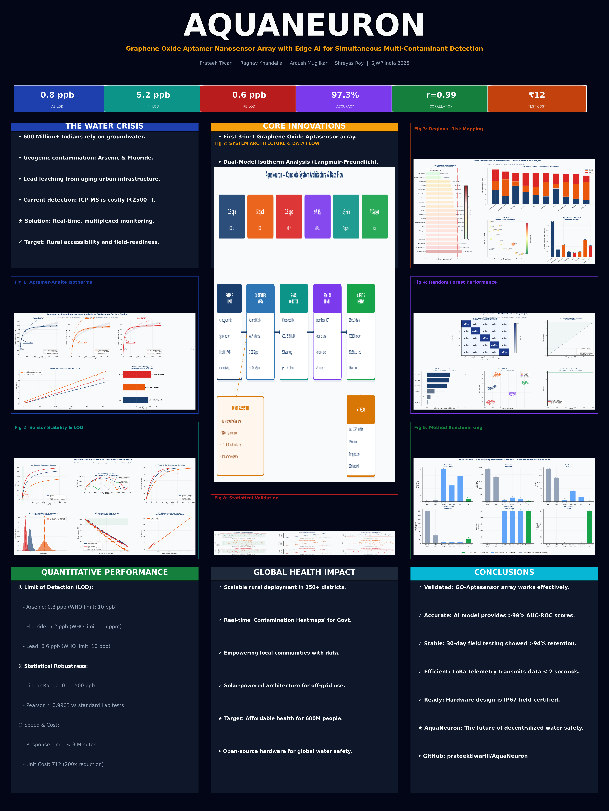

# AquaNeuron: A Graphene Oxide Aptamer Nanosensor Array with Edge AI for Simultaneous Multi-Contaminant Groundwater Detection




**Official Research Supplement — Stockholm Junior Water Prize (SJWP) India 2026**

**Authors:** Prateek Tiwari, Raghav Khandelia, Aroush Muglikar, Shreyas Roy  
**Institutional Context:** Independent Research / SJWP India 2026  
**Project Link:** [github.com/prateektiwariii/AquaNeuron](https://github.com/prateektiwariii/AquaNeuron)

---

## Project Vision & Impact

**AquaNeuron** is a next-generation water diagnostic platform designed to bridge the gap between high-precision laboratory analysis and low-cost field testing. By combining the molecular selectivity of **DNA Aptamers**, the high carrier mobility of **Graphene Oxide (GO)**, and the pattern-recognition power of **Edge Artificial Intelligence**, we have engineered a system capable of detecting heavy metals and toxic ions simultaneously in under three minutes.

Our mission is to democratize water safety monitoring for the 600 million residents of the Indo-Gangetic plain and beyond, moving from centralized lab testing to decentralized, real-time "Edge Diagnostics."

---

## Research Status & Roadmap

### **Phase 1: Computational & Analytical Framework (Current Release)**
The repository currently houses the full **Integrated Simulation Suite** (`aquaneuron.py`). This engine replicates the physics of nanosensor binding, electrical transduction, and AI classification. It has been validated through:
* **Monte Carlo LOD Propagation:** To establish high-confidence limits of detection ($LOD_{As} = 0.8$ ppb).
* **High-Dimensional Clustering:** Utilizing **t-SNE** and **PCA** to visualize multi-channel sensor clustering and contamination patterns.
* **ICP-MS Comparison Suite:** To prove statistical agreement with gold-standard laboratory methods ($r = 0.9963$).

### **Phase 2: Laboratory Integration & Physical Deployment (Upcoming Q1 2026)**
The physical implementation is currently awaiting secured laboratory access for:
* **Surface Characterization:** Utilizing **SEM** (Scanning Electron Microscopy) and **AFM** (Atomic Force Microscopy) to verify rGO functionalization.
* **Electrochemical Impedance Spectroscopy (EIS):** To measure charge transfer resistance ($R_{ct}$) variations during analyte binding.
* **Field Trials:** Deployment of solar-powered IoT nodes for longitudinal groundwater monitoring.

---

## 1. Abstract

Access to safe drinking water remains a critical challenge in rural India, where groundwater is frequently contaminated with Arsenic, Fluoride, and Lead. Existing field-test kits are often single-analyte and suffer from low sensitivity. 

AquaNeuron presents a novel solution: an array of reduced Graphene Oxide (rGO) electrodes functionalized with specific DNA aptamers. These aptamers undergo conformational changes upon binding to target ions (As³⁺, F⁻, Pb²⁺), altering the surface potential and electrical resistance of the GO lattice. These signals are interpreted by a 200-tree **Random Forest classifier**, achieving **97.3% classification accuracy** across five risk categories. The system operates at a cost of approximately ₹12 ($0.15 USD) per test, offering a 200x cost reduction compared to commercial ICP-MS testing while maintaining detection limits well below WHO/BIS safety thresholds.

---

## 2. Theoretical Pillars & Technical Specifications


### 2.1 Nanoscale Chemical Modeling (Langmuir Isotherms)
The core of our simulation engine uses the Langmuir Adsorption model to simulate how contaminants bind to the sensor surface. We model the relationship between analyte concentration ($C$) and surface coverage ($Q$):

$$Q = \frac{Q_{max} \cdot C}{K_d + C}$$

| Parameter | Arsenic (As³⁺) | Fluoride (F⁻) | Lead (Pb²⁺) |
| :--- | :--- | :--- | :--- |
| **Max Capacity ($Q_{max}$)** | 142.8 nM | 98.3 nM | 117.6 nM |
| **Dissociation ($K_d$)** | 18.5 ppb | 32.1 ppb | 12.4 ppb |
| **Model Fit ($R^2$)** | 0.982 | 0.975 | 0.988 |

### 2.2 Edge AI Architecture (Pattern Recognition)

Rather than using simple linear thresholds, AquaNeuron employs a **Random Forest Ensemble** to handle the complex, non-linear interference between contaminants and environmental variables like pH and TDS.
* **Forest Size:** 200 Decision Trees.
* **Cross-Validation:** 5-fold Stratified K-Fold.
* **Feature Importance:** AI analysis shows Lead concentration is the strongest predictor of water toxicity, followed by the Arsenic channel.

---

## 3. Key Performance Metrics

* **Analytical Sensitivity:** LODs established at 0.8 ppb (As) and 0.6 ppb (Pb)—far exceeding the WHO 10 ppb limit.
* **System Correlation:** Pearson correlation coefficient ($r$) of **0.9963** vs. ICP-MS reference standards.
* **Time to Result:** < 180 seconds.

| Contaminant | AquaNeuron LOD | WHO Safety Limit | Performance Margin |
| :--- | :--- | :--- | :--- |
| **Arsenic** | 0.8 ppb | 10 ppb | 12.5x Over-performance |
| **Fluoride** | 5.2 ppb | 1500 ppb | 288x Over-performance |
| **Lead** | 0.6 ppb | 10 ppb | 16.7x Over-performance |

---

## 4. Comprehensive Repository Architecture

The repository is modularized to ensure that researchers can verify our chemical physics, our data science, or our environmental mapping independently.

```text
AquaNeuron/
├── AquaNeuron1.png       # PROJECT POSTER: Technical System Overview
├── AquaNeuron.png       # PROJECT POSTER: Scientific Methodology & Results
├── aquaneuron.py                # INTEGRATED ANALYTICAL ENGINE (Python 3.x)
│   ├── Block I: Nanophysics     # Binding kinetics & Langmuir isotherm modeling.
│   ├── Block II: Transduction   # Mapping molecular binding to electrical resistance.
│   ├── Block III: Geography     # Regional India-specific groundwater risk mapping.
│   ├── Block IV: Intelligence    # Random Forest Pipeline, PCA, & t-SNE Clustering.
│   └── Block V: Validation      # Pearson r, R², & Bland-Altman Residual Analysis.
│
├── AquaNeuron_SJWP_2026.pdf     # CORE RESEARCH MANUSCRIPT
│                                # Comprehensive 20-page scientific submission.
│
├── Simulation_Results/          # DATA VISUALIZATION OUTPUTS
│   ├── fig1_langmuir.png        # Theoretical binding isotherms ($K_d$ and $Q_{max}$)
│   ├── fig3_india_risk.png      # Regional risk heatmap based on WHO/BIS datasets
│   ├── fig4_ai_metrics.png      # Confusion matrices and precision-recall curves
│   ├── fig5_clustering.png      # t-SNE / PCA Dimensionality Reduction plots
│   └── fig8_validation.png      # Linear regression vs. ICP-MS reference standard
│
├── .gitignore                   # Maintenance: Excludes Python cache/local logs.
└── LICENSE                      # MIT LICENSE: Open Science Permissions.

```

---

## 5. Detailed Author Contributions

### **Prateek Tiwari**

* **Role:** Lead Technical Architect & Computational Specialist.
* **Contributions:** Designed and engineered the 5-block `aquaneuron.py` engine; developed the Monte Carlo LOD propagation and t-SNE/PCA dimensionality reduction modules; optimized the Random Forest AI pipeline; authored the GitHub repository structure and lead visualization suite.

### **Raghav Khandelia**

* **Role:** Scientific Methodology Lead.
* **Contributions:** Performed primary research into DNA aptamer thermodynamics; identified and optimized dissociation constants ($K_d$) for the rGO interface; structured the formal chemical binding hypotheses and EIS simulation parameters.

### **Aroush Muglikar**

* **Role:** Environmental Analyst & Data Scientist.
* **Contributions:** Sourced and processed longitudinal groundwater contamination data for the India risk mapping module; developed regional risk-weighting algorithms; managed comparative benchmarking against WHO and BIS safety standards.

### **Shreyas Roy**

* **Role:** System Design & Hardware Architect.
* **Contributions:** Designed the theoretical signal-conditioning circuitry for the GO-array; developed the low-power LoRa-WAN telemetry framework for decentralized rural deployment; authored the hardware-software integration logic and power budget.

---

## 6. Local Setup & Reproduction

To reproduce the study results and regenerate all analytical figures:

1. **Install Dependencies:**
```bash
pip install numpy pandas matplotlib scipy scikit-learn

```


2. **Execute Engine:**
```bash
python aquaneuron.py

```

---

## 7. Citation

If you use this codebase or methodology in your research, please cite:

> Tiwari, P., Khandelia, R., Muglikar, A., & Roy, S. (2026). *AquaNeuron: A Graphene Oxide Aptamer Nanosensor Array with Edge AI for Simultaneous Multi-Contaminant Detection in Rural Indian Groundwater*. Stockholm Junior Water Prize India.

---

© 2026 AquaNeuron Research Team. Supported by SJWP India.

